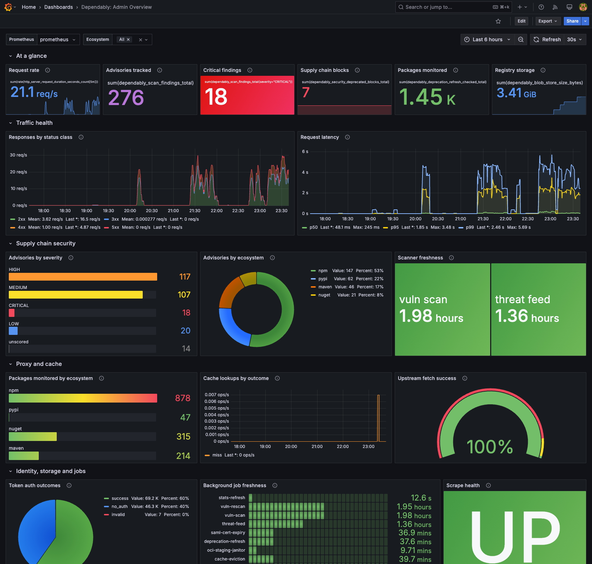

# Grafana dashboard

A ready-made Grafana dashboard for watching a single Dependably instance. It
leads with supply-chain value — advisories tracked, critical findings, downloads
blocked, packages monitored — then covers traffic health, vulnerability posture,
proxy and cache activity, identity, storage, and background-job freshness. The
17 panels are grouped into five rows so you can read it top to bottom.

It is aimed at an **admin running one self-hosted instance**. It queries
**Prometheus only**, so the only moving parts are the Dependably `/metrics`
endpoint and a Prometheus server that scrapes it.

[**Download the dashboard**](dashboards/dependably-admin-overview.json)
(`dependably-admin-overview.json`) — import it into Grafana as described below.



> **Grafana and Prometheus are separate processes.** They are not part of
> Dependably. This guide assumes you already run them, or can stand them up
> (Grafana 10+ / 11.x with a Prometheus data source).

## Prerequisites

### 1. Expose the metrics endpoint

Dependably serves Prometheus metrics at `GET /metrics` on the same host and port
as the registry. The endpoint is gated two ways:

- **Enabled flag** — on by default. If it is off, the endpoint returns
  **404**. Set the `METRICS_ENABLED` environment variable (or the
  `metrics_enabled` instance setting) to `true` to turn it on.
- **IP allowlist** — only callers whose IP is on the allowlist get a **200**;
  everyone else gets **403**. The default allowlist is `127.0.0.1, ::1`
  (localhost only). Add the IP of your Prometheus server with the
  `METRICS_ALLOWED_IPS` environment variable — a comma-separated list of IPs or
  CIDR ranges.

```bash
METRICS_ENABLED=true
METRICS_ALLOWED_IPS=127.0.0.1,::1,10.0.0.5
```

> **Precedence:** environment variable → instance setting → built-in default.
> When an environment variable is set, the matching field is locked in the
> admin UI so there is no conflicting state. If you scrape across a network,
> remember that `/metrics` is unauthenticated — the IP allowlist (plus your
> reverse proxy or firewall) is what protects it.

The endpoint emits only aggregate counters, gauges, and histograms. It carries
no per-tenant, per-user, or per-package labels and no secrets.

### 2. Scrape it with Prometheus

Point Prometheus at the endpoint. Use the job name `dependably` so the
dashboard's scrape-health panel matches:

```yaml
scrape_configs:
  - job_name: dependably
    metrics_path: /metrics
    scheme: https
    static_configs:
      - targets: ["repo.example.com"]
```

Reload Prometheus and confirm the target is **UP** under Status → Targets before
importing the dashboard.

## Import the dashboard

Grafana 10.0+ / 11.x. Two equivalent paths.

### UI import

1. In Grafana, go to **Dashboards → New → Import**.
2. Upload [`dependably-admin-overview.json`](dashboards/dependably-admin-overview.json)
   (or paste its contents).
3. When prompted, pick your Prometheus data source for `DS_PROMETHEUS`.
4. Save.

### Provisioned import

For config-as-code, drop the JSON into Grafana's provisioned-dashboards
directory and add a provider:

```yaml
apiVersion: 1
providers:
  - name: dependably
    folder: Dependably
    type: file
    options:
      path: /etc/grafana/provisioning/dashboards/dependably
```

Place `dependably-admin-overview.json` at
`/etc/grafana/provisioning/dashboards/dependably/` and restart Grafana.

## What the file looks like

The dashboard is a standard Grafana JSON model — the same shape Grafana exports
when you click **Export** on a dashboard you built in the UI. You don't need to
read it to use it; import the file and you're done. For reference, the header and
first panel look like this:

```json
{
  "uid": "dependably-admin-overview",
  "title": "Dependably: Admin Overview",
  "schemaVersion": 39,
  "refresh": "30s",
  "templating": {
    "list": [
      { "name": "DS_PROMETHEUS", "type": "datasource", "query": "prometheus" },
      { "name": "ecosystem", "type": "query",
        "query": "label_values(dependably_scan_findings_total, ecosystem)",
        "includeAll": true, "multi": true }
    ]
  },
  "panels": [
    {
      "type": "stat",
      "title": "Request rate",
      "targets": [
        { "expr": "sum(rate(http_server_request_duration_seconds_count[5m]))" }
      ]
    }
  ]
}
```

The [full file](dashboards/dependably-admin-overview.json) defines all 17 panels
and an `ecosystem` filter you can scope to npm, PyPI, or NuGet.

## What the panels show

**At a glance** — the headline supply-chain and health numbers:

| Panel | Answers |
| ----- | ------- |
| **Request rate** | How much traffic the instance is serving right now |
| **Advisories tracked** | Total vulnerability advisories the scanner has recorded |
| **Critical findings** | Advisories at CRITICAL severity — green at 0, red at 5+ |
| **Supply chain blocks** | Downloads refused by a policy gate (e.g. the deprecated-package gate) |
| **Packages monitored** | Package checks the deprecation-refresh job has performed (catalogue coverage) |
| **Registry storage** | Bytes held across all blob-store tiers |

**Traffic health:**

| Panel | Answers |
| ----- | ------- |
| **Responses by status class** | Request rate split by 2xx/3xx/4xx/5xx — watch the 5xx line |
| **Request latency** | p50 / p95 / p99 server request duration |

**Supply chain security:**

| Panel | Answers |
| ----- | ------- |
| **Advisories by severity** | The shape of your risk for the selected ecosystem |
| **Advisories by ecosystem** | Which package ecosystem carries the most advisories |
| **Scanner freshness** | Time since the `vuln-scan` and `threat-feed` jobs last succeeded |

**Proxy and cache:**

| Panel | Answers |
| ----- | ------- |
| **Packages monitored by ecosystem** | Spread of deprecation-refresh coverage across registries |
| **Cache lookups by outcome** | Hit vs miss rate — the hit share climbs as the cache warms |
| **Upstream fetch success** | Share of upstream fetches that succeeded |

**Identity, storage and jobs:**

| Panel | Answers |
| ----- | ------- |
| **Token auth outcomes** | success / no_auth / invalid mix — watch `invalid` for credential probing |
| **Background job freshness** | Time since each background job last completed successfully |
| **Scrape health** | Whether Prometheus can reach the instance at all (UP / DOWN) |

> **No data on a panel is normal.** The supply-chain and vulnerability panels
> stay empty until a gate fires or the scanner records a finding; the cache and
> upstream panels populate once your tools start pulling packages.

## What it does not show

By design, the metrics behind this dashboard carry no high-cardinality labels —
no per-tenant, per-user, or per-package breakdowns. The numbers here are
instance-wide. For in-product counts (total packages, active users, recent
downloads, blocked pulls), use the built-in
[Overview](../web-ui/dashboard.md) page in the web console.
