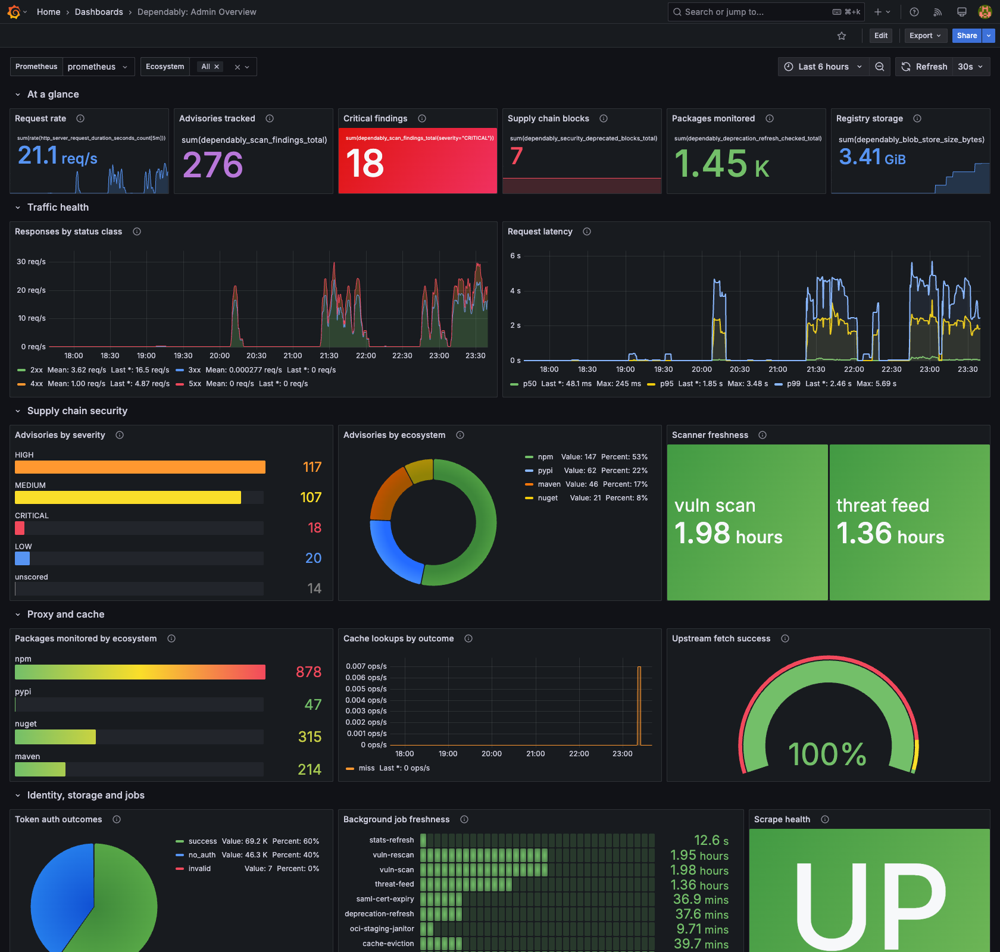

# Grafana dashboard

A ready-made Grafana dashboard for watching a single Dependably instance. It
leads with supply-chain numbers (vulnerability findings, critical findings,
deprecated-version blocks, deprecation checks), then covers traffic health,
vulnerability posture, proxy and cache activity, identity, storage, and
background-job freshness. The panels are grouped into rows so you can read it
top to bottom.

It is aimed at an admin running one self-hosted instance. It queries
Prometheus only, so the only moving parts are the Dependably `/metrics`
endpoint and a Prometheus server that scrapes it.

[**Download the dashboard**](dashboards/dependably-admin-overview.json)
(`dependably-admin-overview.json`), then import it into Grafana as described below.



> **Grafana and Prometheus are separate processes.** They are not part of
> Dependably. This guide assumes you already run them, or can stand them up,
> with Prometheus added to Grafana as a data source.

## Prerequisites

### Expose the metrics endpoint

Dependably serves Prometheus metrics at `GET /metrics` on the same host and port
as the registry. The endpoint is gated two ways:

- The enabled flag is on by default. If it is off, the endpoint returns
  **404**. Set the `METRICS_ENABLED` environment variable (or the
  `metrics_enabled` instance setting) to `true` to turn it on.
- The IP allowlist admits only callers whose IP is on it; they get a **200**
  and everyone else gets **403**. The default allowlist is `127.0.0.1, ::1`
  (localhost only). Add the IP of your Prometheus server with the
  `METRICS_ALLOWED_IPS` environment variable, a comma-separated list of IPs or
  CIDR ranges.

```bash
METRICS_ENABLED=true
METRICS_ALLOWED_IPS=127.0.0.1,::1,10.0.0.5
```

The allowlist checks the source IP as the server sees the connection. A
Prometheus server scraping a Docker container directly may show up as the
Docker bridge gateway (for example `172.17.0.1`) rather than its own address.
If a reverse proxy sits in front of the instance, list it in `TRUSTED_PROXIES`
(see [Configuration](../../admin/configuration.md#behind-a-reverse-proxy)) so
the allowlist sees the forwarded client IP instead of the proxy's.

> **Precedence:** an environment variable wins over an instance setting, which
> wins over the built-in default.
> When an environment variable is set, the matching field on the
> [**Metrics access**](../../admin/settings.md#other-tabs) settings tab is
> locked, so there is no conflicting state. If you scrape across a network,
> remember that `/metrics` is unauthenticated. The IP allowlist (plus your
> reverse proxy or firewall) is what protects it.

The endpoint emits only aggregate counters, gauges, and histograms. It carries
no per-tenant, per-user, or per-package labels and no secrets.

### Scrape it with Prometheus

Point Prometheus at the endpoint. Use the job name `dependably` so the
dashboard's scrape-health panel matches:

```yaml
scrape_configs:
  - job_name: dependably
    metrics_path: /metrics
    scheme: https
    static_configs:
      - targets: ["repo.example.com"]
```

Reload Prometheus and confirm the target is **UP** under **Status**, then
**Targets**, before importing the dashboard.

## Import the dashboard

Import it through the Grafana UI, or provision it from a file.

### UI import

1. In Grafana, open **Dashboards**, choose **New**, then **Import**.
2. Upload [`dependably-admin-overview.json`](dashboards/dependably-admin-overview.json)
   (or paste its contents), then import it.
3. On the dashboard, pick your Prometheus data source from the **Prometheus**
   variable at the top (the `DS_PROMETHEUS` template variable).
4. Save.

### Provisioned import

For config-as-code, drop the JSON into Grafana's provisioned-dashboards
directory and add a provider:

```yaml
apiVersion: 1
providers:
  - name: dependably
    folder: Dependably
    type: file
    options:
      path: /etc/grafana/provisioning/dashboards/dependably
```

Place `dependably-admin-overview.json` at
`/etc/grafana/provisioning/dashboards/dependably/` and restart Grafana.

## What the file looks like

The dashboard is a standard Grafana JSON model, the same shape Grafana exports
when you click **Export** on a dashboard you built in the UI. You don't need to
read it to use it; import the file and you're done. For reference, the header
and the first stat panel look like this, abbreviated:

```json
{
  "uid": "dependably-admin-overview",
  "title": "Dependably: Admin Overview",
  "schemaVersion": 39,
  "refresh": "30s",
  "templating": {
    "list": [
      { "name": "DS_PROMETHEUS", "type": "datasource", "query": "prometheus" },
      { "name": "ecosystem", "type": "query",
        "query": "label_values(dependably_scan_findings_total, ecosystem)",
        "includeAll": true, "multi": true }
    ]
  },
  "panels": [
    {
      "type": "stat",
      "title": "Request rate",
      "targets": [
        { "expr": "sum(rate(http_server_request_duration_seconds_count[5m]))" }
      ]
    }
  ]
}
```

The [full file](dashboards/dependably-admin-overview.json) defines every panel
and an **Ecosystem** filter. The filter lists each ecosystem the scanner has
recorded a finding for, and it scopes the **Advisories by severity**,
**Packages monitored by ecosystem**, **Cache lookups by outcome**, and
**Upstream fetch success** panels.

## What the panels show

Dependably keeps its counters in memory. A panel that sums a counter rather
than taking its rate shows a total since the instance last started, and it
drops back after a restart.

**At a glance:** the headline supply-chain and health numbers.

| Panel | Answers |
| ----- | ------- |
| **Request rate** | How much traffic the instance is serving right now |
| **Advisories tracked** | Vulnerability findings the scanner has recorded since the instance started. A rescan that matches the same advisory counts again, so this measures scan activity, not distinct advisories |
| **Critical findings** | The same count, limited to CRITICAL severity (green at 0, orange from 1, red from 5) |
| **Supply chain blocks** | Downloads refused because the version is deprecated upstream and the deprecated-package policy blocks it. Refusals by other gates are not counted here |
| **Packages monitored** | Package versions the deprecation-refresh job has checked |
| **Registry storage** | Bytes held across the cache and registry blob-store tiers |

**Traffic health:**

| Panel | Answers |
| ----- | ------- |
| **Responses by status class** | Request rate split by 2xx/3xx/4xx/5xx. Watch the 5xx line |
| **Request latency** | p50 / p95 / p99 server request duration |

**Supply chain security:**

| Panel | Answers |
| ----- | ------- |
| **Advisories by severity** | Findings by severity for the selected ecosystems |
| **Advisories by ecosystem** | Which package ecosystem carries the most findings |
| **Scanner freshness** | Time since the `vuln-scan` and `threat-feed` jobs last succeeded (yellow after 2 hours, red after 6) |

**Proxy and cache:**

| Panel | Answers |
| ----- | ------- |
| **Packages monitored by ecosystem** | Spread of deprecation-refresh checks across ecosystems |
| **Cache lookups by outcome** | Hit vs miss rate. The hit share climbs as the cache warms |
| **Upstream fetch success** | Share of upstream fetches that succeeded (red below 90%, green from 99%) |

**Identity, storage and jobs:**

| Panel | Answers |
| ----- | ------- |
| **Token auth outcomes** | success / no_auth / invalid mix. Watch `invalid` for credential probing |
| **Background job freshness** | Time since each background job last completed successfully (yellow after 4 hours, red after 12) |
| **Scrape health** | Whether Prometheus can reach the instance at all (UP / DOWN) |

> **No data on a panel is normal.** The supply-chain and vulnerability panels
> stay empty until a gate fires or the scanner records a finding since the
> instance last started; the cache and upstream panels populate once your
> tools start pulling packages.

## What it does not show

By design, the metrics behind this dashboard carry no high-cardinality labels:
no per-tenant, per-user, or per-package breakdowns. The numbers here are
instance-wide. For in-product counts (total packages, active users, recent
downloads, blocked pulls), use the built-in
[Overview](../../web-ui/dashboard.md) page in the web console.
