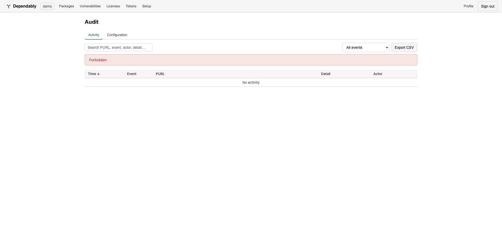

# Audit log

The **Audit log** is a searchable, exportable record of what happened in your
organization — every fetch, push, block, login, and configuration change.

> Reading the audit log requires the `read:audit` capability, held by the
> **admin**, **owner**, and **auditor** roles. A member account that opens this
> page sees a **Forbidden** notice instead of events — see
> [Access control (RBAC)](../admin/rbac.md).

## Two views

The page has two tabs:

- **Activity** — package- and access-level events: first fetches, pushes,
  imports, downloads, vulnerability scans, deletes, manual block / unblock,
  every kind of policy block (manual, release age, malicious, KEV, EPSS, vuln
  score, deprecated), and login success / failure / lockout.
- **Configuration** — administrative changes: organization, retention, and proxy
  settings; SAML configuration and logins; token and service-token lifecycle;
  member role changes, removals, and invites; allow/block-list and license-policy
  edits; package claims; and security events such as a blocked SSRF attempt or an
  upstream checksum mismatch.

## Find an event

- **Search** by PURL, event, actor, or detail (the Configuration tab searches
  action, actor, PURL, and detail).
- **Filter** by event type with the dropdown.
- Events are sorted by **Time**, newest first.

Each row records the **time**, the **event** or **action**, the **PURL** it
concerns (where relevant), a **detail** string, and the **actor** who triggered
it.

## Export

Select **Export CSV** to download the current view for offline analysis or to
hand to a compliance process.
