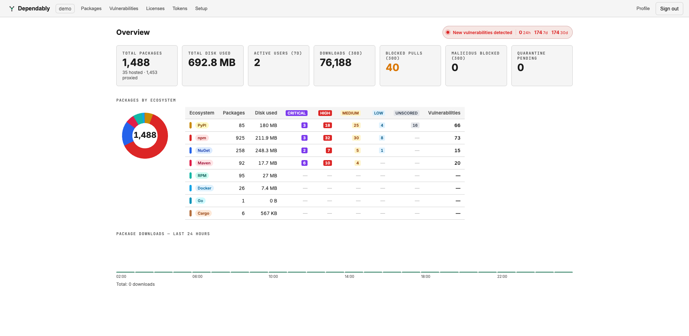

# Overview dashboard

The **Overview** is the first page after sign-in (and the page the **Dependably**
logo returns you to). It answers, at a glance: how much is in the registry, how
much disk it uses, what's being pulled, and what's being blocked.

## Headline metrics

A row of cards across the top summarizes the organization:

| Card | What it counts |
| ---- | -------------- |
| **Total packages** | Every package across all ecosystems, split into **hosted** (published to your registry) and **proxied** (cached from an upstream). |
| **Total disk used** | Storage occupied by all cached and published artifacts. |
| **Active users (7d)** | Distinct users who pulled or pushed in the last 7 days. |
| **Downloads (30d)** | Artifact downloads served in the last 30 days. |
| **Blocked pulls (30d)** | Pull requests refused by a policy gate in the last 30 days. |
| **Malicious blocked (30d)** | Downloads blocked specifically by the malware gate in the last 30 days. |
| **Quarantine pending** | Versions awaiting review. Select it to open the [Quarantine](quarantine.md) queue. |

A **New vulnerabilities detected** banner shows how many advisories were found in
the last 24 hours, 7 days, and 30 days. Select it to open
[Vulnerabilities](vulnerabilities.md), newest first.

## Packages by ecosystem

A table breaks the totals down per ecosystem (PyPI, npm, NuGet, Maven, RPM,
Docker, Go, Cargo), with package count, disk used, a count of advisories at each
severity (**Critical**, **High**, **Medium**, **Low**, **Unscored**), and the
total vulnerabilities for that ecosystem. A doughnut chart beside it shows each
ecosystem's share of the total package count.

## Package downloads — last 24 hours

A bar chart of download volume per hour over the last day, with the running
total beneath it — a quick read on whether traffic is flowing as expected.

> The numbers reflect your **current organization** only. The label next to the
> **Dependably** logo shows which organization you are viewing.
