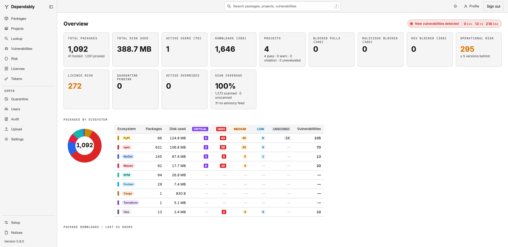

# Overview dashboard

The **Overview** is the first page after sign-in and the page the **Dependably**
logo returns you to. It answers, at a glance: how much is in the registry, what
is being pulled, what is being blocked, and where the risk sits.

All numbers cover your organization only. The scoring terms (CVSS, EPSS,
KEV) are defined in the [Glossary](../glossary.md).

## New vulnerabilities

The ribbon in the top corner reads **New vulnerabilities detected** or **No new
vulnerabilities**, with counts for the last **24h**, **7d**, and **30d**. It
counts advisories the scanner matched to one of your cached versions in that
window, so an old advisory on a package you cached yesterday counts as new.
Select it to open [Vulnerabilities](vulnerabilities.md) sorted newest first.

When your organization has SAML single sign-on configured and the identity
provider's signing certificate expires within 7 days, a **SAML cert expiring**
card shows the days remaining. Once the certificate has expired, a **SAML cert
expired** card shows the expiry date. Either card is a cue to tell an
administrator.

## Metric cards

| Card | What it counts |
| ---- | -------------- |
| **Total packages** | Every package across all ecosystems, split into **hosted** (published to your registry) and **proxied** (cached from an upstream). |
| **Total disk used** | Storage occupied by all cached and published artefacts. When your organization has a storage quota, the card shows it. |
| **Active users (7d)** | Distinct people and service tokens with recorded activity in the last 7 days. A personal token counts as the person who owns it. |
| **Downloads (30d)** | Downloads served in the last 30 days, including first fetches from upstream. Blocked attempts are not counted. |
| **Projects** | Your organization's projects (folders are not counted), and how many of their latest versions pass, warn, violate, or await policy evaluation. Select it to open [Projects](projects.md). |
| **Blocked pulls (30d)** | Downloads refused in the last 30 days, by a policy gate or by a manual block. Hover for the count per gate. |
| **Malicious blocked (30d)** | How many of those the malware gate refused. |
| **KEV blocked (30d)** | How many of those the Known Exploited Vulnerabilities gates refused, including the ransomware gate. |
| **Operational risk** | Packages with at least one cached version that is 5 or more stable releases behind upstream. Select it to open [Risk](risk.md). |
| **Licence risk** | Cached versions whose licence is on the block list, or that have no licence recorded at all. Select it to open [Risk](risk.md). |
| **Quarantine pending** | Versions a gate has held that are waiting for an administrator's decision. |
| **Active overrides** | Versions an administrator has approved out of quarantine, and how old the oldest approval is. |
| **Scan coverage** | The share of versions the vulnerability scanner has checked, with the scanned and unscanned counts. Versions in an ecosystem that has no vulnerability database are shown as a third count and left out of the percentage. |

For a member, the blocked, quarantine, and override cards show the number
only. Roles that can open the [Audit log](audit.md) select a blocked card to
see the matching events, and administrators select the quarantine and override
cards to open the matching Quarantine view.

## Packages by ecosystem

A doughnut chart shows each ecosystem's share of the package total. Beside it a
table lists, per ecosystem, the package count, disk used, the number of
advisories at each severity (**CRITICAL**, **HIGH**, **MEDIUM**, **LOW**, and
**UNSCORED** for advisories that carry no score), and their total under
**Vulnerabilities**. These are current counts, not a 30-day window. An
ecosystem is listed when it has packages or advisories.

<!-- tells: allow-next -->
## Package downloads — last 24 hours

A bar per hour of downloads served over the last day, with the total beneath.
Blocked attempts are not included.

## Trends (30d)

The **Vulnerabilities**, **Blocked pulls**, and **Downloads** cards track the
advisory total from the ecosystem table, **Blocked pulls (30d)**, and
**Downloads (30d)**, recorded once a day. Each shows today's value, the change
against the value 7 days ago, and a sparkline of up to 30 days. Until two days
have been recorded, the section reads *Not enough history yet*.

## Prevention (30d)

One count per policy gate shows how many downloads that gate refused in the
last 30 days, busiest gate first; together they add up to **Blocked pulls
(30d)**. The gates are deprecated, revoked, release age, licence, install
script, provenance, malicious, KEV, KEV · ransomware, EPSS, and vuln score, and
a **manual** count joins them when an administrator blocked a version by hand.
A gate that never fired shows 0. When nothing was blocked, a note says whether
every pull passed or no pulls were served. What each gate checks, and its
enforcement mode, is set by an administrator in
[Settings](../admin/settings.md).
