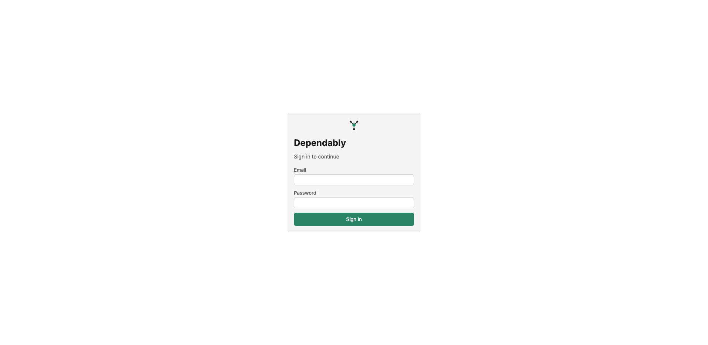

# The web UI

Dependably ships with a built-in web console. Open your **base URL** in a
browser (for example `https://repo.example.com`) and sign in to browse what your
registry holds, see which versions carry advisories, create the token your tools
need, and copy a ready-made config snippet for each ecosystem.

Everything here works without server access or config files — see
[Getting started](../getting-started.md) for the base URL and token every guide
needs.

## Signing in

The base URL opens a sign-in screen. Enter your **email** and **password** and
select **Sign in**. If your organization requires multi-factor authentication
you are prompted for your 6-digit code on the way in; if it uses SAML single
sign-on you are redirected to your identity provider. See
[Authentication](../admin/authentication.md) for both flows.

Your current organization is shown as a label next to the **Dependably** logo in
the top bar.

## What's where

The top navigation is the same on every page:

| Area | What you do there |
| ---- | ----------------- |
| **Overview** | The dashboard — totals, packages by ecosystem, recent download activity. Select the **Dependably** logo to return here. |
| [**Packages**](packages.md) | Browse, search, and filter every package; open a package to see its versions, origin, checksums, and advisory status. |
| [**Vulnerabilities**](vulnerabilities.md) | Every known advisory affecting a cached version, with severity, CVSS score, and a link to the OSV record. |
| [**Licenses**](license-policy.md) | The license policy — which SPDX licenses are allowed or blocked, and whether the policy is enforced. |
| [**Tokens**](tokens.md) | Create and revoke the personal access tokens your package managers authenticate with. |
| [**Setup**](setup.md) | Copy a ready-made configuration snippet for npm, pip, NuGet, Maven, Cargo, Go, Docker, or RPM. |
| [**Profile**](profile.md) | Your account — change your password, enable two-factor authentication, switch theme or language. |

Two further pages open from inside the console rather than the top bar:

- [**Quarantine**](quarantine.md) — the review queue for versions a policy gate
  blocked. Open it from the **Quarantine pending** card on the Overview.
- [**Audit log**](audit.md) — a searchable, exportable record of every event in
  your organization.

## What you can see depends on your role

The console shows you what your role allows. A **member** can browse packages and
vulnerabilities, view the license policy, manage their own tokens, copy setup
snippets, and edit their own profile. Reviewing the [Quarantine](quarantine.md)
queue and reading the [Audit log](audit.md) require elevated permissions — a
member who opens those pages sees a **Forbidden** notice instead of data. Roles
and the capabilities behind them are described in
[Access control (RBAC)](../admin/rbac.md).
