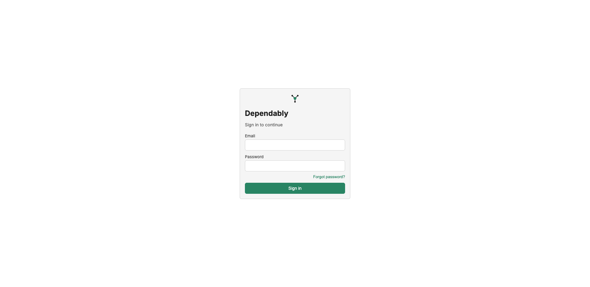

# The web UI

Dependably ships with a built-in web console. Open your **base URL** in a
browser (for example `https://repo.example.com`) and sign in to browse what your
registry holds, check a package before you add it, see which versions carry
advisories, create the token your tools need, and copy a ready-made
configuration for each package manager.

Everything here works without server access or config files — see
[Getting started](../getting-started.md) for the base URL and token every guide
needs.

## Signing in

The base URL opens a sign-in screen. Enter your **Email** and **Password** and
select **Sign in**.

- If your account has two-factor authentication, the same card asks for the
  **6-digit code** from your authenticator app. You can tick **Remember this
  device for 30 days**, or choose **Use a recovery code instead**.
- If your organization uses SAML single sign-on, a **Sign in with SSO** link
  appears below the form and takes you to your identity provider.
- If too many attempts fail, the button is disabled for a countdown shown on
  screen.
- **Forgot password?** asks for your email and sends a reset link. The
  confirmation is the same whether or not the address exists. The link opens a
  page where you set a new password of at least 12 characters.

The first time you sign in with a password an administrator set for you, the
console takes you straight to [Profile](profile.md) to choose your own. If your
organization requires two-factor authentication, the same page walks you
through setting it up before you can continue.

## Finding your way around

Navigation is a sidebar on the left. Select the **Dependably** logo at the top
of it to return to the [Overview](dashboard.md); the button beside the logo
collapses the sidebar to icons.

| Sidebar item | What you do there |
| ------------ | ----------------- |
| [**Packages**](packages.md) | Browse and search every package the registry holds; open one to see its versions, checksums, licence, and advisory status. |
| [**Projects**](projects.md) | The applications you build, each described by an uploaded SBOM, with the components and findings of every version. |
| [**Lookup**](lookup.md) | Check a package for malware, known vulnerabilities, and licence policy before you add it. Nothing is downloaded or cached. |
| [**Vulnerabilities**](vulnerabilities.md) | Every known advisory affecting a cached version, with severity, score, exploit likelihood, and a fix recipe. |
| [**Risk**](risk.md) | Versions that are far behind upstream, and versions whose licence is blocked or unknown. |
| [**Licences**](license-policy.md) | Your organization's licence policy: which SPDX licences are allowed, conditional, or blocked, and whether it is enforced. |
| [**Tokens**](tokens.md) | Create and revoke the personal access tokens your package managers sign in with. |

The bottom of the sidebar holds three more items:

- [**Setup**](setup.md) — a three-step wizard that creates a token and gives
  you the configuration for your package manager.
- **Notices** — opens the open-source notices: every third-party component
  Dependably is built from, with its version and licence.
- **Version** — the version of Dependably you are using.

The bar across the top holds a **search box**, a **Profile** button that opens
[your account settings](profile.md), and **Sign out**.

### Search

Press `/` anywhere in the console to jump to the search box, then type at least
two characters. Results are grouped into **Packages**, **Projects**, and
**Vulnerabilities**. Use the arrow keys and Enter, or select a result, to open
the package, the project, or the Vulnerabilities page filtered to that advisory.

### Banners

Above the page you may see a notice an administrator has posted for everyone,
a strip warning that the instance is served over plain HTTP (dismiss it once
and it stays dismissed on that browser), or an **Air-gapped** badge in the
sidebar when the instance has no route to the public registries.

## What a member sees

> The screenshots in this section were taken by an administrator, so they show
> the **Admin** section in the sidebar and a notification bell in the top bar.
> A member's console has neither; everything else is the same.

Every page listed above is available to every signed-in user. Administrators
and owners also see an **Admin** section in the sidebar — Quarantine, Users,
Audit, Upload, and Settings. Those pages do not appear in a member's sidebar,
and a bookmarked link to one of them opens the Overview instead. The roles and
what each allows are described in [Access control (RBAC)](../admin/rbac.md).

Each session belongs to exactly one organization. On a multi-tenant instance
you reach your organization through its own address, for example
`https://acme.repo.example.com`, and everything you see belongs to it.
