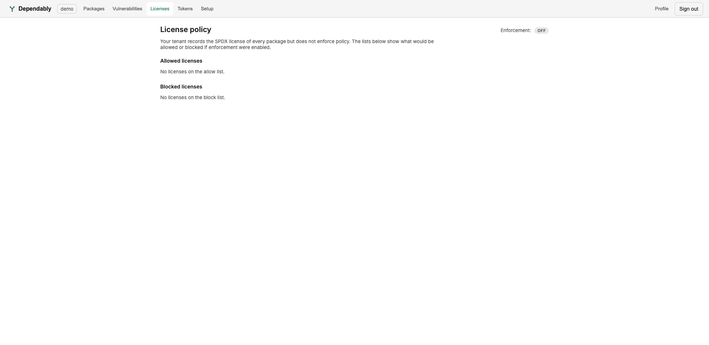

# License policy

The **Licenses** page shows your organization's license policy: which SPDX
licenses are explicitly allowed or blocked, and whether the policy is being
enforced.

Dependably records the SPDX license of every package it caches, so this
information is always available even when enforcement is off.

## Enforcement

The **Enforcement** indicator at the top reads **OFF** or **ON**:

- **OFF** — licenses are recorded but never block a pull. The allow and block
  lists below show what *would* happen if you turned enforcement on, so you can
  preview a policy before committing to it.
- **ON** — the lists are applied to pulls.

## Allowed and blocked licenses

Two lists make up the policy:

- **Allowed licenses** — an allow list. When populated, only these licenses pass.
- **Blocked licenses** — a block list of licenses to refuse.

Either list may be empty. An empty allow list and empty block list mean no
license restriction.

## Who can change it

Every member can view this page. Changing the enforcement mode or editing the
lists is an administrative action — these edits are recorded in the
[Audit log](audit.md) (as *License policy mode changed* and the allow/block list
events). See [Access control (RBAC)](../admin/rbac.md) for who holds that
permission.
