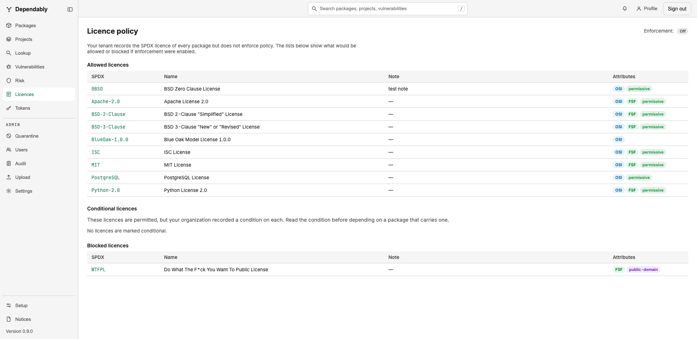

# Licence policy

The **Licences** page shows your organization's licence policy: which SPDX
licences are allowed, which are permitted with a condition, which are blocked,
and whether the policy is being enforced.

Dependably records the SPDX licence of every package it caches, so the
information is there even when enforcement is off, and every version's
[package page](packages.md) shows its licence against this policy.

## Enforcement

The **Enforcement** indicator at the top shows one of three modes, and the
sentence beneath it says what that mode means for you:

- **Off** — licences are recorded but never affect a pull or a publish. The
  lists show what *would* be allowed or blocked if enforcement were turned on.
- **Warn** — packages are still served and published. A publish whose licence
  violates the policy is recorded in the [Audit log](audit.md).
- **Block** — a publish or an upstream fetch is refused when the package's
  licence is not on the allow or conditional list, or appears on the block
  list. For npm, PyPI, NuGet, Maven, Cargo, RPM, and Hex a package with no
  licence recorded at all is refused too, and an empty allow list refuses every
  package that declares one. A refused download reaches your package manager
  as [a blocked package](../package-managers/blocked-packages.md).

## The three lists

| List | What it means for a package carrying the licence |
| ---- | ------------------------------------------------- |
| **Allowed licences** | Passes the policy. |
| **Conditional licences** | Passes the policy, but your organization recorded a condition on it. Read the **Condition** column before depending on a package that carries one. |
| **Blocked licences** | Refused under **Block**. The block list wins over the other two. |

Each row shows the **SPDX** identifier, the licence **Name**, the **Note** or
**Condition** an administrator recorded, and **Attributes**: **OSI** and
**FSF** approval, the copyleft class (permissive, weak copyleft, strong
copyleft, network copyleft, or public domain), and **deprecated** for an
identifier SPDX has retired. Select an SPDX identifier to read the full
licence text; where Dependably has no bundled copy, a **View upstream** link
opens the reference text.

## Who can change it

Every member can view this page. Changing the enforcement mode or editing the
lists is an administrative action, done from **Settings**, and each edit is
recorded in the [Audit log](audit.md) as *Licence policy mode changed* or an
allow-list, conditional, or block-list event. See
[Access control (RBAC)](../admin/rbac.md) for who holds that permission.

## Related

- Versions already in your registry whose licence is blocked, conditional, or
  unknown: [Risk](risk.md).
- Check a package's licence against the policy before you add it:
  [Lookup](lookup.md).
