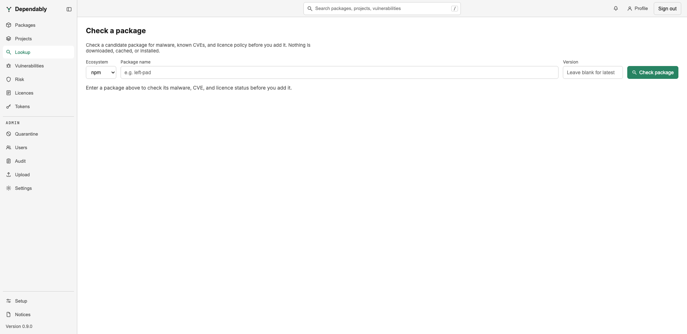

# Check a package before you add it

The **Lookup** page checks a candidate package for malware, known
vulnerabilities, and licence policy before you add it to a project. Nothing is
downloaded, cached, or installed. Every signed-in user can use it.

## Run a check

1. Choose the **Ecosystem**: npm, PyPI, NuGet, Maven, Go, Cargo, or Hex.
   Docker, RPM, Alpine apk, and Terraform are not offered because they have no
   advisory feed or no upstream metadata to check.
2. Enter the **Package name**. For Maven, enter the `groupId:artifactId`
   coordinate.
3. Enter a **Version**, or leave it blank to check the latest stable release.
4. Select **Check package**.

A package or version that does not exist upstream is reported as **No such
package**, with the name and version that were looked up, so a typo is easy to
spot.

## Read the result

The verdict at the top is one of:

- **Allowed** — no policy gate objects.
- **Warn** — something needs your judgement: a licence outside the allow list,
  a conditional licence, a deprecated package, or a finding your organization
  has set to warn rather than block. The licence policy alone never produces
  more than a warning here.
- **Blocked** — a policy gate would refuse the package if you pulled it:
  it is malicious, in the CISA Known Exploited Vulnerabilities Catalog, too
  new for the release-age hold, deprecated, or above your organization's
  vulnerability score or exploit-likelihood tolerance.

Three cards give the detail:

| Card | What it shows |
| ---- | ------------- |
| **Malware** | **Known malicious package**, with the advisory identifiers, or **No known malicious advisories**. |
| **Vulnerabilities** | Advisories split into **Scored** and **UNSCORED / NO CVSS**. An unscored advisory has an undisclosed severity, which is not the same as no risk. A **CISA KEV** badge marks confirmed exploitation; an **EPSS** value gives the probability of exploitation in the next 30 days. |
| **Licence** | The licence recorded upstream and the current policy mode, with one of: **Allowed by policy**, **Permitted with a condition**, **Not allowed by policy**, **Recorded informationally** when the policy is off, or **Not determinable** for ecosystems whose metadata carries no licence. |

A **Not checked at lookup time** list appears when a check that normally runs
could not: the release-age hold, deprecation status, licence, or the
vulnerability scan. That happens when upstream metadata is unavailable for the
ecosystem, when upstream could not be reached, or when the instance is
air-gapped. On an air-gapped instance the page says so, and advisories come
from the local mirror only; give a version explicitly, because "latest" cannot
be resolved without upstream.

## What a verdict does not do

Lookup reports what the gates would say today. When your package manager
installs the package, that download goes through the same gates at that moment, and your organization's policy may have
changed in between. The gates and their thresholds are set by an administrator
in [Settings](../admin/settings.md); the terms are in the
[Glossary](../glossary.md).
