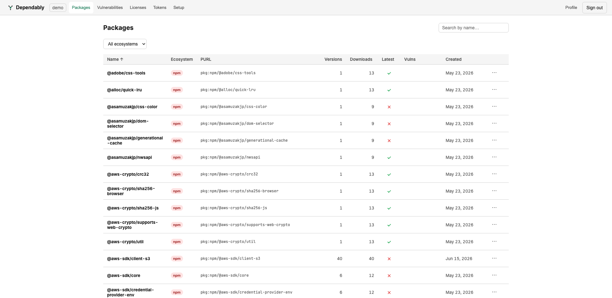
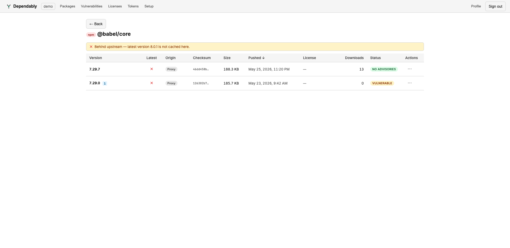

# Browsing packages

The **Packages** page lists every package your registry holds — both the ones you
published and the ones proxied from upstream — and lets you drill into any one to
see its versions, where each came from, and whether it carries an advisory.

## Find a package

- **Search by name** with the box at the top.
- **Filter by ecosystem** with the dropdown (All ecosystems, PyPI, npm, NuGet,
  Maven, RPM, Docker, Go, Cargo).
- **Sort** by selecting a column header.
- **Page** through results at the bottom; choose 20, 50, 100, or 200 rows per
  page.

Each row shows:

| Column | Meaning |
| ------ | ------- |
| **Name** | The package name. |
| **Ecosystem** | A coloured badge for the ecosystem. |
| **PURL** | The package URL identifier, for example `pkg:npm/@babel/core`. |
| **Versions** | How many versions are cached locally. |
| **Downloads** | All-time download count. |
| **Latest** | Whether the newest upstream version is cached. A check means the latest upstream version is here; a cross means a newer upstream version exists but is not cached. |
| **Vulns** | A badge with the count of distinct vulnerabilities affecting the package, grouped by severity, when any apply. |
| **Created** | When the package first appeared in your registry. |

Select any row to open the package.

## Package detail

The package page lists every cached version. If a newer version exists upstream
that you have not cached, a banner notes it (for example, *Behind upstream —
latest version 8.0.1 is not cached here*).

| Column | Meaning |
| ------ | ------- |
| **Version** | The version string. A small badge marks how many advisories affect it. |
| **Tag** | *(OCI images only)* The image tag for this version. |
| **Latest** | Whether this is the latest upstream version. |
| **Origin** | **Proxy** (cached from an upstream) or **Hosted** (published to your registry). |
| **Checksum** | The verified content hash, truncated. |
| **Size** | Artifact size. |
| **Pushed** | When this version landed in your registry. |
| **License** | The detected SPDX license, when known. |
| **Downloads** | Download count for this version. |
| **Status** | One of **No advisories**, **Vulnerable**, **Allowed (vulnerable)**, **Malicious**, **Deprecated**, **Unscanned**, or **Blocked**. |
| **Actions** | **Download** the artifact. Multi-file versions (e.g. a Maven jar + pom, or a PyPI wheel + sdist) have no single download — expand the row to download each file individually. |

## Override the same-version push policy for one package

Your organization sets a default policy for whether a version may be re-pushed
over an existing one. From the **⋯** menu on a package's row in the list you can
override that default for a single package: the menu offers the option opposite
to your org default — **Allow same-version push** when the default blocks, or
**Block same-version push** when it allows — plus **Inherit (org default)** to
drop the override and follow the organization setting again.

The organization-wide setting (`versionOverwritePolicy`) and exactly when a
per-package override applies — the default `block` allows no exceptions, while
`exception` lets a package opt in and `allow` lets one opt out — are covered in
[Settings](../admin/settings.md).

## Related

- Advisories across all packages: [Vulnerabilities](vulnerabilities.md).
- Versions a policy gate has blocked from serving: [Quarantine](quarantine.md).
