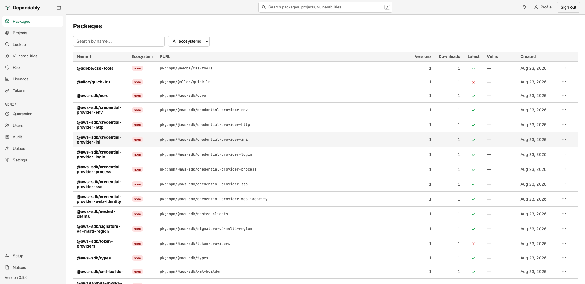

# Browsing packages

The **Packages** page lists every package your registry holds — both the ones
your organization published and the ones proxied from upstream — and lets you
open any one to see its versions, verify a checksum, and check whether it
carries an advisory.

## Find a package

- **Search by name** — the box matches any part of the package name.
- **Filter by ecosystem** — All ecosystems, PyPI, npm, NuGet, Maven, RPM,
  Docker, Go, Cargo, Alpine apk, Terraform, or Hex.
- **Sort** by selecting a column header. Every column sorts except **Latest**.
- **Page** through results at the bottom; choose 20, 50, 100, or 200 rows per
  page.

| Column | Meaning |
| ------ | ------- |
| **Name** | The package name. A **Malicious** badge means a version is flagged as known-malicious; a **KEV** badge means a version carries an advisory in the CISA Known Exploited Vulnerabilities Catalog. |
| **Ecosystem** | A coloured badge for the ecosystem. |
| **PURL** | The package URL, a standard identifier for the package, for example `pkg:npm/@babel/core`. |
| **Versions** | How many versions are in your registry. |
| **Downloads** | All-time download count. |
| **Latest** | A check means the newest upstream version is here; a cross means a newer upstream version exists but is not cached; a dash means there is nothing to compare against. Hover for the upstream version number. A warning icon beside it marks a package **abandoned**: no upstream release in over a year. |
| **Vulns** | One pill per severity with the count of advisories affecting the package, or a dash when none are known. |
| **Created** | When the package first appeared in your registry. |

Select a row to open the package. The **⋯** menu at the end of a row offers
**Copy install command** — the plain install command for that package manager,
pointing at your registry — except for Maven and Terraform, which need a
version, and Docker, which needs a tag. Administrators use the same menu to
override the organization's same-version push policy for one package; see
[Settings](../admin/settings.md).

## Package detail

The header names the package, shows whether it is **Hosted** (published to
your registry) or **Proxy** (cached from an upstream), and lists the
description, author, and homepage or repository links when the package
provides them. Beneath it:

- **Applications ship this** — when any of your [projects](projects.md) list
  this package in their software bill of materials (SBOM), a line says how
  many; expand it to see which.
- **Security**, **Licence**, and **Operational** pillars — the worst advisory
  severity, the licence standing, and how far the package sits behind upstream.
- **Banners** — *Behind upstream — latest version x is not cached here* or *Up
  to date with upstream*, and *Abandoned — no new release published upstream in
  over a year* when that applies.

### Versions

| Column | Meaning |
| ------ | ------- |
| **Version** | The version string, with badges for anything notable: the file count for multi-file versions, **yanked**, **deprecated** (hover for the reason), **revoked**, **runs install scripts**, the signature status (**signature verified**, **signature failed**, or **unsigned**), and NuGet symbol packages. Severity pills show the advisories affecting the version. |
| **Tag** | *(Docker only)* The image tags that point at this digest. |
| **Latest** | A check means this is the newest upstream version; a cross means a newer one exists; a dash means there is nothing to compare against. |
| **Size** | Artefact size, summed across files for multi-file versions. |
| **Pushed** | When this version last landed in your registry. |
| **Licence** | The SPDX licence recorded for the version, or **unknown**. It is marked when your organization's policy blocks it or flags it as conditional. |
| **Downloads** | Download count for this version. |
| **Status** | **No advisories**, **Vulnerable**, **Allowed (vulnerable)**, **Deprecated**, **Blocked**, **Unscanned** (not checked yet), or **No advisory feed** for ecosystems that have no vulnerability database. The last two mean Dependably could not vouch for the version either way, not that it is clean. A **Malicious** badge appears beside the status when the version is flagged. |
| **Actions** | **Download** the artefact. |

Expand a row for the details: the full **SHA-256** checksum with a **Copy**
button (and the upstream integrity value where the ecosystem publishes one) —
compare it with `sha256sum <file>` on a download to confirm the bytes match —
the install command for this exact version, how many releases behind upstream
it is, when it was last scanned, and every advisory affecting it. Multi-file
versions — a Maven jar with its pom, a PyPI wheel with its sdist, a NuGet
package with its symbols — list each file with its own checksum, size, and
**Download** button. Where the upstream registry has a page for the version, a
**View page** link opens it.

### What an administrator sees here

Administrators and owners also see **Rescan**, **Block**, **Unblock**, and
**Delete** on a version's **Actions** menu, and a **claim** badge when the
package name has been reserved for your organization. Those actions and the
roles that hold them are described in [Access control (RBAC)](../admin/rbac.md).

## Related

- Advisories across all packages: [Vulnerabilities](vulnerabilities.md).
- Versions that are behind upstream or carry a risky licence: [Risk](risk.md).
- Check a package you have not cached yet: [Lookup](lookup.md).
