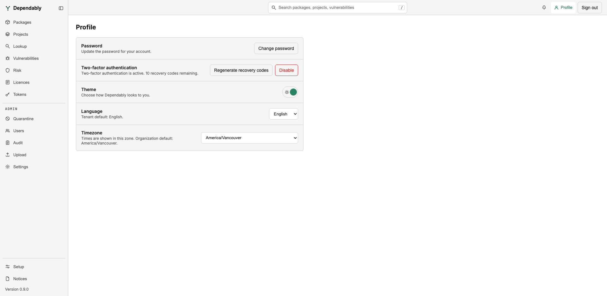

# Your profile

The **Profile** button in the top bar opens your personal account settings:
your password, two-factor authentication, and how the console looks to you.
**Sign out** sits beside it.

## Change your password

Select **Change password**, then enter your current password and the new one
twice. A password must be at least 12 characters, must not be the one you are
replacing, and is rejected when it is easy to guess or contains your email
name, your organization's name, or the word "dependably".

Changing your password signs out your other sessions and revokes your API
tokens, so create fresh [tokens](tokens.md) afterwards. The browser you changed
it from stays signed in.

If an administrator set your current password, the console brings you here
first and will not let you continue until you have chosen your own.

## Two-factor authentication

Add a second factor with an authenticator app that generates time-based
one-time passwords (TOTP):

1. Select **Set up** next to **Two-factor authentication**.
2. Scan the QR code with your authenticator app, or enter the **Manual entry
   key** by hand.
3. Enter the 6-digit code your app shows and select **Enable two-factor
   authentication**.
4. Dependably shows **10 recovery codes**. Save them somewhere safe. Each
   works once and lets you sign in if you lose your authenticator. They are
   shown only this once; **Copy** puts them on your clipboard.

From then on you enter a code at sign-in, or tick **Remember this device for
30 days**. Without your authenticator, choose **Use a recovery code instead**
on the sign-in screen and enter one of the saved codes. The row shows how many recovery codes you have left, with two more
actions:

- **Regenerate recovery codes** — enter a code from your app or an unused
  recovery code to get a new set of 10. The old set stops working.
- **Disable** — enter your current password and a code from your app or a
  recovery code. Disabling signs out your other sessions, revokes your API
  tokens, and forgets every remembered device.

If your organization requires two-factor authentication, the console opens
this setup for you after sign-in and will not let you continue until it is
done. The organization-wide setting is described in
[Authentication](../admin/authentication.md).

## Theme

The **Theme** switch chooses light or dark. Your choice is remembered on this
browser only.

## Language

Choose **English** or **Français**. The row shows your organization's default,
which applies until you pick one here. Your choice is saved to your account,
so it follows you to other browsers.

## Timezone

Times throughout the console are shown in this zone. Leave **Use organization
default** selected to follow your organization, or pick any zone from the
list. This too is saved to your account.

## Open-source notices

The list of third-party components Dependably is built from, with each
version and licence, is under **Notices** at the bottom of the sidebar rather
than on this page. It is useful for your own compliance records.
