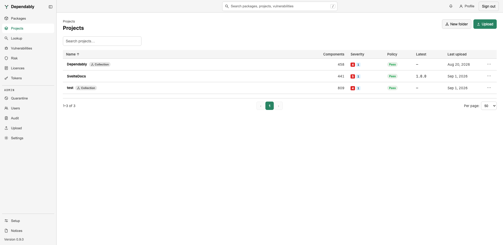

# Projects

**Packages** are the artefacts your registry serves. **Projects** are the
applications you build with them. Each project holds one or more versions, and
each version is described by an uploaded software bill of materials (SBOM), so
you can see every component an application ships, which of them carry
advisories, and whether the version passes your organization's policy.

Every signed-in user can browse projects, open any version, and export its
documents. Creating, uploading, and triaging are administrator actions — see
[What needs an administrator](#what-needs-an-administrator).

## Browse projects

The list shows every project and folder at the top level. Type in **Search
projects…** to match any part of a name; a project nested in a folder shows
indented under its folder.

| Column | Meaning |
| ------ | ------- |
| **Name** | The project or folder. Folders carry a **Collection** badge. |
| **Components** | How many components the latest version's SBOM lists. |
| **Severity** | Advisory counts for the latest version by severity, plus a **known exploited** badge when any is in the CISA Known Exploited Vulnerabilities Catalog. A dash means no known vulnerabilities. |
| **Policy** | The latest version's verdict: **Pass**, **Warn**, **Violation**, or **Not scanned** when it has not been evaluated. |
| **Latest** | The version marked latest. |
| **Last upload** | When a document was last uploaded to the project. |

Select a row to open it.

### Folders

A folder groups projects and holds no versions of its own. Opening one shows
counts rolled up across everything inside it — **Projects (all levels)**,
**Components (rolled up)**, **Findings (rolled up)**, and **Policy (rolled
up)** — and a **Projects in this collection** table. The rolled-up policy is
the worst verdict in the folder, and a note reads *n of m not evaluated* when
some projects have never been scanned.

## A project and its versions

The project page shows **Versions**, **Components (latest)**, and **Policy
(latest)**, then a **Versions** table with each version's component count,
policy verdict, and upload date. The version marked **Latest** carries a badge.
Select a version to open it.

## A version's components

The version page is where the analysis lives.

- **Policy** — a ribbon showing the verdict, with the component total split by
  production and development scope, and a priority breakdown. When the verdict
  is **Violation**, select the ribbon to show only the violating components.
- **Risk pillars** — the worst advisory severity, the licence findings, and the
  policy verdict, side by side.
- **Filters** — search by name; narrow by scope (All, Prod, Dev), by severity,
  or by reachability; show only policy violations; include suppressed findings.
- **The component table** — one row per component with its version, whether
  the registry knows it (blocked, deprecated, outdated, unknown, or never
  served here), whether it is a direct or transitive dependency, its licences,
  its advisories, and a priority of **act**, **attend**, **track**, or
  **suppressed**. Expand a row to read each advisory and any triage decision
  recorded against it.
- **Unmatched analysis** — statements from an uploaded VEX (Vulnerability
  Exploitability eXchange) or SARIF (Static Analysis Results Interchange
  Format) document that named a package the SBOM does not contain. They are
  shown rather than dropped.
- **Documents** — every document uploaded for this version, with its type,
  format, producing tool, SHA-256 digest, size, and uploader. **Download
  original** returns the exact bytes that were uploaded.

**Export** on the version page produces a fresh document from what Dependably
knows now: an **SBOM — inventory (CycloneDX)**, an **SBOM — with
vulnerabilities (VDR)**, or a **VEX document**.

## What needs an administrator

Members read; administrators and owners change. The following controls do not
appear for a member:

- **Upload** an SBOM, VEX, or SARIF document, from the page or through the
  API. The upload accepts CycloneDX 1.4–1.7 JSON, OpenVEX, and SARIF 2.1.0; VEX
  and SARIF enrich the SBOM already uploaded for that version. Uploads are
  capped at 50 MB unless the operator raises the limit.
- **New folder**, and **Edit…** or **Delete** on a project or folder. Deleting
  a folder removes everything inside it.
- **Promote to latest** and **Delete** on a version.
- **Rescan** a version against current advisories, at most once an hour.
- Record a triage decision on a finding.
- **Export** from a folder page, which bundles every project in the folder at
  its latest version.

A member who needs any of these asks an administrator, who will find the
project-level permissions in [Access control (RBAC)](../admin/rbac.md).

## Related

- SBOM, VEX, SARIF, and the scoring terms: [Glossary](../glossary.md).
- The registry's own view of a component: [Packages](packages.md).
- Every advisory across every cached version: [Vulnerabilities](vulnerabilities.md).
