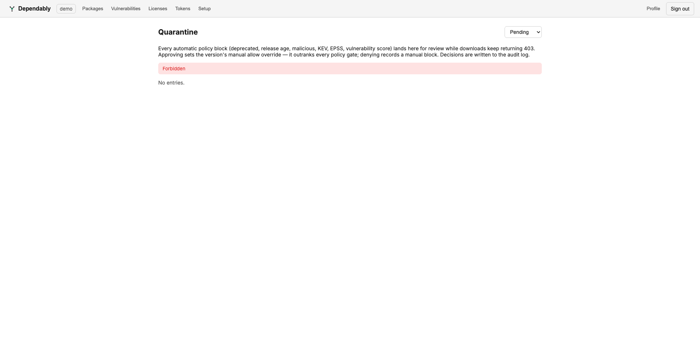

# Quarantine review

The **Quarantine** queue is where versions blocked by a supply-chain policy wait
for a human decision. Open it from the **Quarantine pending** card on the
[Overview](dashboard.md).

> Reviewing the queue requires elevated permissions. A member account that opens
> this page sees a **Forbidden** notice instead of entries — see
> [Access control (RBAC)](../admin/rbac.md).

## What lands here

Every automatic policy block lands in the queue for review while downloads of
that version keep returning `403`. A version can be held by any of the
supply-chain gates — the full set and their thresholds are defined in
[Settings](../admin/settings.md).

## Filter the queue

The dropdown filters by decision state: **Pending**, **Approved**, **Denied**,
or **All**. The queue opens on **Pending**.

## Approve or deny

For each held version you make one decision:

- **Approve** sets the version's **manual allow override**. This outranks every
  policy gate, so the version serves from then on even if a gate still matches.
- **Deny** records a **manual block**.

Either way the decision is written to the [Audit log](audit.md), so there is a
durable record of who allowed or blocked what, and when.
