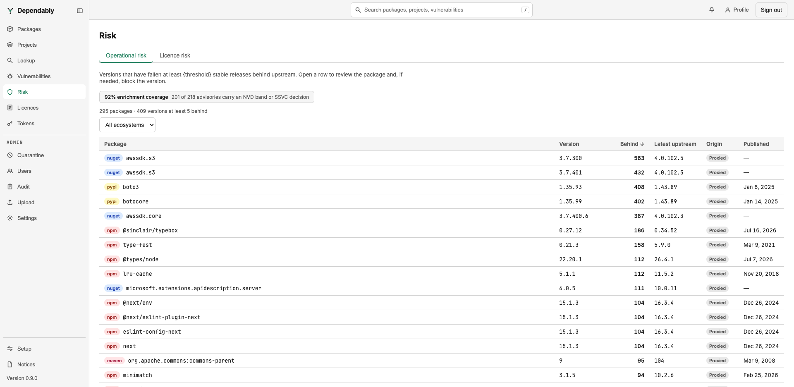

# Risk

The **Risk** page lists the versions in your registry that deserve a second
look for a reason other than a vulnerability: they are far behind upstream, or
their licence is blocked, conditional, or unknown. Every signed-in user can
open it. It is read-only — select a row to open the
[package](packages.md), where an administrator can block or allow the version.

## Operational risk

Versions that have fallen at least 5 stable releases behind upstream. The
threshold is fixed. The summary line above the table gives the package and
version counts.

| Column | Meaning |
| ------ | ------- |
| **Package** | The package, with its ecosystem badge. |
| **Version** | The cached version. |
| **Behind** | How many stable releases upstream has published since. The list opens sorted by this column, largest first. |
| **Latest upstream** | The newest version upstream. |
| **Origin** | **Hosted** (published to your registry) or **Proxied** (cached from upstream). |
| **Published** | When the version was published. |

## Licence risk

Versions whose licence stands out against your organization's
[licence policy](license-policy.md), whatever the enforcement mode. The
**Reason** column and its filter distinguish three cases:

| Reason | Meaning |
| ------ | ------- |
| **Blocklisted** | The version carries a licence on the block list. |
| **No licence** | No licence could be extracted from the version at all. |
| **conditional** | The version carries a licence your organization permits with a condition. |

The other columns are **Package**, **Version**, **Licences** (the SPDX
identifiers recorded), **Origin**, and **Published**.

## Filters and the enrichment line

Both tabs filter by **Ecosystem**. The line above the table also reports
whether advisories are being enriched from a vulnerability tracker: either
**Vulnerability-tracker connection not configured**, **No advisories to
enrich**, or the percentage of advisories the tracker has been consulted for.
Connecting a tracker is an administrator setting.

## Related

- Advisories affecting cached versions: [Vulnerabilities](vulnerabilities.md).
- The counts on the [Overview](dashboard.md) **Operational risk** and **Licence
  risk** cards open these tabs. The Overview's licence count leaves conditional
  licences out; this page lists them.
