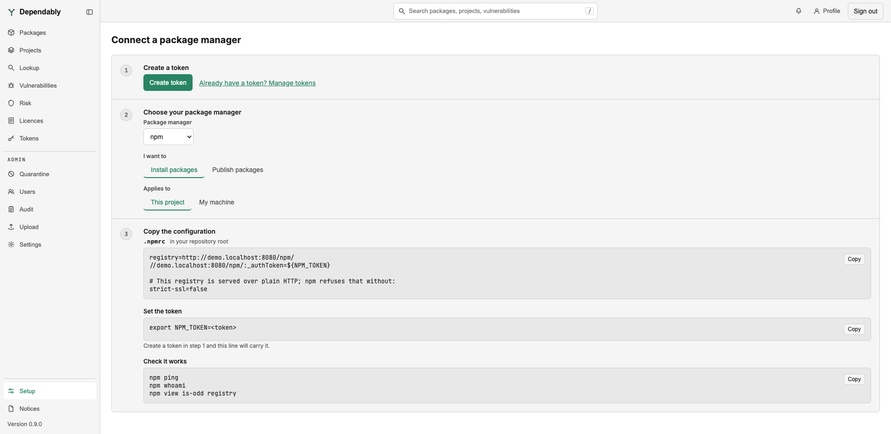

# Connect a package manager

The **Setup** page, at the bottom of the sidebar, walks you from nothing to a
working package manager in three steps: create a token, choose what you are
configuring, and copy the result. The configuration is already filled in with
your instance's address, so there are no URLs to hand-edit.

## 1. Create a token

Select **Create token**. The wizard creates a personal token with the scope
that matches the **I want to** choice in step 2 (pull for installing, push for
publishing), so pick that first if you plan to publish. The token is shown once — **Copy this now — it is not shown again.** The token has no
expiry; manage it later from [Tokens](tokens.md).

Already have one? **Already have a token? Manage tokens** takes you to the
Tokens page instead. If you created a pull token and then switch step 2 to
publishing, a warning says the token is read-only; select **Create a different
token**.

## 2. Choose your package manager

- **Package manager** — PyPI, npm, NuGet, Maven, RPM, Docker, Go, Cargo,
  Alpine apk, Terraform, or Hex.
- **I want to** — **Install packages** or **Publish packages**. Go, Alpine apk,
  and Terraform are install-only on the registry, and the page says so.
- **Applies to** — **This project** (a file committed with your code that
  reads the token from an environment variable) or **My machine** (a file in
  your home directory that holds the token in clear text and stays out of
  source control). Docker has only the machine option.
- **Tool** — shown when the ecosystem has more than one: pip, Poetry, uv, or
  twine for PyPI; Maven, Gradle, or Gradle Kotlin for Maven; Mix or Rebar3 for
  Hex.

## 3. Copy the configuration

The result has three parts, each with a **Copy** button:

- **The file** — its name, where it goes (*in your repository root*, *in your
  home directory*, *on each developer's machine, not committed*), and its
  contents. A file that holds the token in clear text carries a reminder to
  keep it out of source control and restrict its permissions.
- **Set the token** — the `export` line that puts the token in your terminal
  for the install, filled in with the token from step 1.
- **Check it works** — the command that proves the tool is talking to your
  registry.

Where a package manager needs a note before you paste, it appears above the
file. On an instance served over plain HTTP: Maven 3.8.1 and later refuse the
repository unless you serve it over HTTPS or add a mirror declaring
`blocked=false`; Terraform rejects an `http://` mirror outright; Docker refuses
the registry until the daemon opts in through `daemon.json`. Tools with a
username field are told that any value works, because Dependably
authenticates on the token alone.

## What each package manager gets

The examples use `repo.example.com`; the page shows your real host.

| Package manager | Install file | Registry URL | Check it works | Publish with |
| --------------- | ------------ | ------------ | -------------- | ------------ |
| **PyPI** | `pip.conf` or `pyproject.toml` (project); `~/.config/pip/pip.conf` (machine) | `https://repo.example.com/simple/` | `pip install requests` | twine, with `~/.pypirc` |
| **npm** | `.npmrc` | `https://repo.example.com/npm/` | `npm ping`, `npm whoami` | `npm publish` |
| **NuGet** | `NuGet.config` (project) or `dotnet nuget add source` (machine) | `https://repo.example.com/nuget/v3/index.json` | `dotnet restore` | `dotnet nuget push --api-key <token>` |
| **Maven** | `pom.xml` or `build.gradle` / `build.gradle.kts`, plus `~/.m2/settings.xml` | `https://repo.example.com/maven/` | `mvn dependency:resolve` | `mvn deploy` or `./gradlew publish` |
| **RPM** | `/etc/yum.repos.d/dependably.repo` | `https://repo.example.com/rpm/` | `dnf repolist dependably` | `curl --upload-file pkg.rpm …/rpm/upload` |
| **Docker** | `docker login`; `daemon.json` only for plain HTTP | `repo.example.com/<image>:<tag>` | `docker pull` | `docker push` |
| **Go** | `.envrc` setting `GOPROXY`, plus `~/.netrc` | `https://repo.example.com/go,direct` | `go mod download` | install-only |
| **Cargo** | `.cargo/config.toml`, plus `~/.cargo/credentials.toml` | `sparse+https://repo.example.com/cargo/` | `cargo build` | `cargo publish --registry dependably` |
| **Alpine apk** | `/etc/apk/repositories` | `https://user:<token>@repo.example.com/apk/…` | `apk update` | install-only |
| **Terraform** | `~/.terraformrc` | `https://user:<token>@repo.example.com/terraform/` | `terraform init` | install-only |
| **Hex** | Mix: a `mix hex.repo add` command; Rebar3: `~/.config/rebar3/rebar.config` | `https://repo.example.com/hex` | `mix deps.get` or `rebar3 get-deps` | `mix hex.publish` or `rebar3 hex publish` |

## Go deeper

The wizard is the fast path. Each tool has a full guide covering verify,
publishing, and revert steps:

[npm](../package-managers/npm.md) ·
[PyPI](../package-managers/pypi.md) ·
[NuGet](../package-managers/nuget.md) ·
[Maven](../package-managers/maven.md) ·
[Cargo](../package-managers/cargo.md) ·
[Go](../package-managers/go.md) ·
[Terraform](../package-managers/terraform.md) ·
[Hex](../package-managers/hex.md) ·
[Docker](../containers-and-system/docker.md) ·
[RPM](../containers-and-system/rpm.md)
