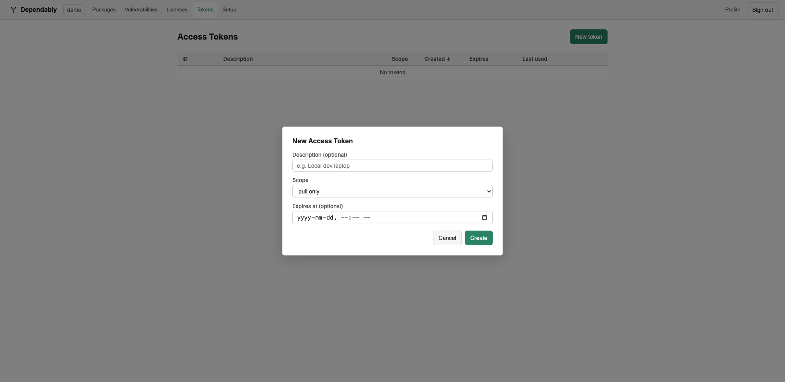

# Access tokens

Your package managers authenticate to Dependably with a token. The **Tokens**
page is where you create your personal tokens and revoke ones you no longer need.

A personal token is tied to your account and is best for your own machine. For
CI and shared automation, use a **service token** instead — see
[Users & tokens](../admin/users-and-tokens.md).

## Create a token

1. Open **Tokens** and select **New token**.
2. Optionally enter a **Description** (for example, *Local dev laptop*) so you
   can tell your tokens apart later.
3. Choose a **Scope**:
   - **pull only** — install and download packages.
   - **push only** — publish packages.
   - **push & pull** — both.
4. Optionally set an **Expires at** date and time. Leave it empty for a token
   that does not expire — though a dated token you rotate is safer.
5. Select **Create**.

Dependably shows the token value **once**, at creation. Copy it then and store it
in your tool's credential store or your CI secret manager — it is kept only as a
hash and cannot be shown again. If you lose it, revoke it and create a new one.

> **Keep tokens secret.** Treat a token like a password. Create a separate token
> per machine or pipeline so you can revoke one without disrupting the others.

## Review and revoke

The table lists your existing tokens with their **ID**, **Description**,
**Scope**, **Created**, **Expires**, and **Last used** time, so you can spot a
token that is unused or past its purpose and revoke it.

## Use the token

Each ecosystem guide shows the exact command that stores the token in that tool's
own config — start from [Setup](setup.md) for a ready-made snippet, or open the
full guide for your tool from the [documentation home](../index.md).

The scope you pick maps to the underlying capabilities a token carries; the full
capability model is described in [Access control (RBAC)](../admin/rbac.md).
