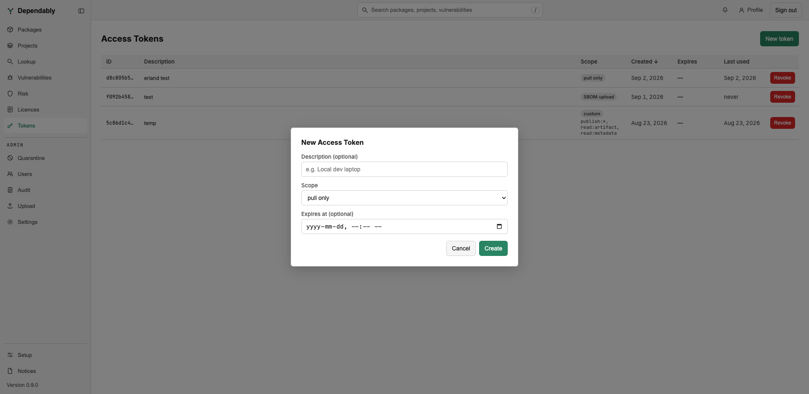
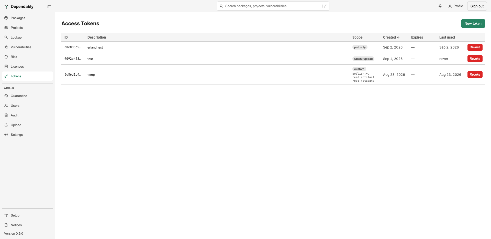

# Access tokens

Your package managers authenticate to Dependably with a token. The **Tokens**
page is where you create your personal tokens and revoke ones you no longer
need. The [Setup](setup.md) wizard can create one for you as its first step;
this page is for managing them afterwards.

A personal token is tied to your account and is best for your own machine. For
CI and shared automation an administrator creates a **service token** — one
that belongs to the organization rather than to a person — see
[Users & tokens](../admin/users-and-tokens.md).

## Create a token

1. Open **Tokens** and select **New token**.
2. Optionally enter a **Description** (for example, *Local dev laptop*) so you
   can tell your tokens apart later.
3. Choose a **Scope**:
   - **pull only** — install and download packages.
   - **push only** — publish packages.
   - **push & pull** — both.

   A token can never do more than your own role allows. A member's role can
   only pull, so choosing a push scope is refused when you select **Create**;
   publishing needs the Admin or Owner role. Admins and Owners also see three
   privileged scopes: **admin** (read and change organization settings),
   **audit** (read the audit log, for SIEM integrations), and **SBOM upload**
   (upload SBOM, VEX, and SARIF documents to [Projects](projects.md) from CI).
4. Optionally set **Expires at**. Leave it empty for a token that does not
   expire — though a dated token you rotate is safer.
5. Select **Create**.

Dependably shows the token value **once**, with a **Copy** button. Store it in
your tool's credential store or your CI secret manager — it is kept only as a
hash and cannot be shown again. If you lose it, revoke it and create a new one.

> **Keep tokens secret.** Treat a token like a password. Create a separate token
> per machine or pipeline so you can revoke one without disrupting the others.

Each organization has a ceiling on active tokens, personal and service
combined. If you hit it, the dialog says so; revoke tokens you no longer use.

## Review and revoke

The table lists your tokens with their **ID**, **Description**, **Scope**,
**Created**, **Expires**, and **Last used** time — **never** for a token that
has not been used, and an **expired** badge once the expiry has passed — so
you can spot a token that is unused or past its purpose. Select **Revoke** and
confirm the browser prompt. Revocation is immediate.

Changing your [password](profile.md) or disabling two-factor authentication
also revokes every token you own.

## Use the token

Each ecosystem guide shows the exact command that stores the token in that
tool's own config — start from [Setup](setup.md) for a ready-made
configuration, or open the full guide for your tool from the
[documentation home](../index.md). The roles and what each allows are in
[Access control (RBAC)](../admin/rbac.md).
