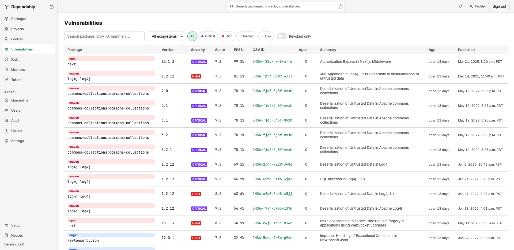

# Vulnerabilities

The **Vulnerabilities** page lists every known security advisory affecting a
version cached in your registry, so you can see your exposure across all
ecosystems in one place. Each entry is matched against the
[OSV](https://osv.dev) database. For CVSS, EPSS, KEV, and other terms, see the
[Glossary](../glossary.md).

## Find an advisory

- **Search** by package name, version, OSV ID, or summary text.
- **Filter by ecosystem** with the dropdown.
- **Sort** by selecting a column header — the list opens sorted by **Severity**,
  most serious first.
- **Page** through results at the bottom; choose 20, 50, 100, or 200 rows per
  page.

Each row shows:

| Column | Meaning |
| ------ | ------- |
| **Package** | The affected package, with its ecosystem badge. |
| **Version** | The specific cached version the advisory applies to. |
| **Severity** | Critical, High, Medium, or Low — the advisory's CVSS band. |
| **Score** | The CVSS base score, taken from the advisory or computed from its vector, or a dash when the advisory has none. |
| **EPSS** | The probability the vulnerability is exploited in the wild within the next 30 days, as a percentage. Refreshed daily. Use it to rank *which* High you fix first. |
| **KEV** | Shown when an advisory alias is in the [CISA Known Exploited Vulnerabilities Catalog](https://www.cisa.gov/known-exploited-vulnerabilities-catalog) — confirmed exploited, independent of score. Fix these first regardless of severity band. |
| **MALICIOUS** | An OSV `MAL-` report. A verdict, not a score: remove the package, there is no fixed version to upgrade to. |
| **OSV ID** | The advisory identifier (for example `GHSA-…`), linking to its full record on osv.dev. |
| **Summary** | A one-line description of the issue. |
| **Published** | When the advisory was published. |

A version may also be marked **revoked** — it disappeared from the upstream
registry. That is a lifecycle signal rather than a vulnerability, but a takedown
can indicate a compromised release.

> **An advisory with no score is unscored, not safe.** It shows no severity band
> and never meets an alert threshold. Read it and judge it yourself rather than
> reading the empty band as a clean result.

## Read one advisory

Select a row to expand the advisory detail: summary, aliases linked to their
home databases (GHSA to the GitHub Advisory Database, CVE to NVD), references,
affected ranges, and a remediation section holding three things:

- **Fixed in** — the version to upgrade to. Dependably resolves the fix of the
  affected range *containing your installed version*, using the ecosystem's own
  version ordering (npm semver, PEP 440, NuGet, Maven). For other ecosystems it
  falls back to the first fixed version the advisory names.
- **CWE chips** — the weakness classes the advisory carries, linked to
  cwe.mitre.org and each mapped to its
  [OWASP Top 10:2025](https://owasp.org/Top10/2025/) category. The OWASP page is
  the background reading: what the class is, how it is exploited, and how to
  prevent it structurally.
- **Fix with your AI agent** — a curated remediation playbook, below.

## Fix it with an AI assistant

A skill is a Markdown playbook an AI coding assistant follows. Your instance
serves six, chosen by what the advisory carries:

| Skill | Applies when |
| ----- | ------------ |
| `fix-vulnerable-dependency` | Any advisory with a fixed version — the lockfile-aware upgrade recipe, direct and transitive, per ecosystem |
| `fix-injection` | Injection-class weaknesses (SQL, command, or code injection; input validation) |
| `fix-xss` | Cross-site-scripting weaknesses |
| `fix-path-traversal` | Path traversal and link-following weaknesses |
| `fix-ssrf` | Server-side request forgery weaknesses |
| `fix-unsafe-deserialization` | Untrusted deserialization and mass assignment |

The playbook itself is assistant-neutral. Pick your assistant in the remediation
section and the install command adapts:

| Assistant | Installs to | Invoked |
| --------- | ----------- | ------- |
| Claude Code | `~/.claude/skills/<id>/SKILL.md` | discovered by name |
| OpenAI Codex | `~/.codex/prompts/<id>.md` | `/<id>` |
| GitHub Copilot | `.github/prompts/<id>.prompt.md`, in your repository | `/<id>` |

The **Install skill** one-liner needs no token — the endpoint it fetches from is
anonymous. The **Prompt** beside it is pre-filled with the advisory ID, the
affected package, your installed version, and the resolved fixed version; paste
it into the assistant after installing. Using no assistant is fine too: the
playbooks are plain Markdown, so open the same URL and follow the recipe by
hand.

## What an advisory does and does not do

Seeing an advisory here does not by itself stop the version being served —
whether a vulnerable version is blocked depends on your organization's
supply-chain gates (vulnerability score, KEV, EPSS, malware). Those gates, and
the scores they key on, are described in [Settings](../admin/settings.md).
Versions a gate has blocked land in the [Quarantine](quarantine.md) queue for
review; a package manager refused a download sees
[a blocked package](../package-managers/blocked-packages.md).

To see the advisories on one package in context, open it from
[Packages](packages.md) — each version's **Status** column shows whether it is
**Vulnerable**.
